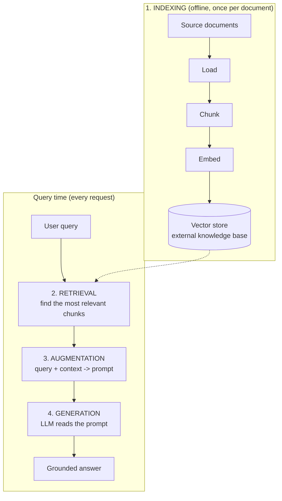
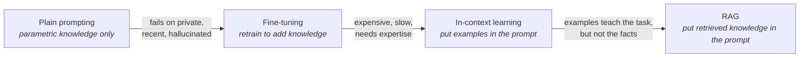

# What is RAG

> Status: `studied` | Section: [Foundations](../README.md)

## What is it?

Retrieval-Augmented Generation is a technique that gives a language model the
information it needs **at the moment the question is asked**, instead of relying
only on what the model memorised during pre-training.

The mechanism is deliberately unglamorous:

1. Take the user's question.
2. Search an external knowledge base for the passages most likely to answer it.
3. Paste those passages into the prompt, next to the question.
4. Let the LLM answer from that prompt.

Nothing about the model changes. No weights are updated. The only thing that
changes is what the model can see while it is generating.

RAG is the joining of two fields that developed separately:

| Field | Age | Contribution to RAG |
| --- | --- | --- |
| Information retrieval | Decades old (search engines, IR research) | Finding the right documents for a query |
| Text generation | New, LLM-driven | Turning those documents into a fluent, direct answer |

Neither half is new. The combination is what became useful once LLMs got good
enough to read a block of supplied text and answer from it reliably.

## Why does it exist?

An LLM stores everything it knows in its weights. That knowledge is called
**parametric knowledge**, and it is frozen the moment pre-training ends. Three
things follow immediately:

- It cannot contain data the model never saw (private, internal, personal).
- It cannot contain anything that happened after the training cutoff.
- It cannot be inspected or corrected — a wrong fact in the weights is not a row
  you can edit.

RAG exists because the alternative — retraining the model every time knowledge
changes — is expensive, slow, and requires expertise most teams do not have.
RAG turns knowledge from *parameters* into *data*, and data is cheap to add,
update and delete.

The full argument is in [02-why-rag](../02-why-rag/), and the comparison with
retraining is in [04-rag-vs-finetuning](../04-rag-vs-finetuning/).

## Problem it solves

Three concrete failures of plain prompting, in short form:

| Problem | Why plain prompting fails | How RAG fixes it |
| --- | --- | --- |
| Private data | The model never saw it during pre-training | The knowledge base is built from that private data |
| Recent data | Everything after the knowledge cutoff is missing | New documents are just added to the knowledge base |
| Hallucination | Generation is probabilistic; the model invents plausible text | The answer is constrained to supplied context, and the model is told to say "I don't know" |

## How it works

Four stages. The first happens offline, ahead of time; the other three happen on
every query.



- **Indexing** — prepare the knowledge base so it can be searched efficiently later.
- **Retrieval** — given a query, find the 3–5 chunks most likely to answer it.
- **Augmentation** — build a prompt that contains both the query and those chunks.
- **Generation** — the LLM answers, using the supplied context plus its own
  parametric knowledge.

Step-by-step detail is in [03-rag-architecture](../03-rag-architecture/).

## Architecture

RAG is the end point of a progression, and it is easier to remember as a
progression than as an isolated idea:



The last arrow is the important one. In-context learning showed that a
sufficiently large model can pick up a *task* from examples placed in the
prompt. RAG applies the same channel to a different payload: instead of examples
showing **how** to solve the task, it injects the **facts needed** to solve this
particular instance of it.

### In-context learning — the capability RAG is built on

> In-context learning is a core capability of a large language model, where the
> model learns to solve a task purely by seeing examples in the prompt, without
> updating its weights.

The practical form is **few-shot prompting** — a handful of solved examples
placed before the real question:

```text
Below are examples of text labelled with their sentiment.
Use the examples to determine the sentiment of the final text.

Text: I love this phone. It's so smooth.   Sentiment: positive
Text: This app crashes a lot.              Sentiment: negative
Text: The camera is amazing.               Sentiment: positive

Text: I hate the battery life.             Sentiment: ?
```

The model infers the task from the pattern and answers `negative`. The same
technique works for named entity recognition, extraction, classification, maths
word problems, or any domain-specific task.

**In-context learning is an emergent property.**

> An emergent property is a behaviour or ability that suddenly appears in a
> system when it reaches a certain scale or complexity, even though it was not
> explicitly programmed or expected from the individual components.

Nobody designed LLMs to do this. GPT-1 and GPT-2 did not reliably show it — give
them examples in a prompt and there was no guarantee they would generalise from
them. At GPT-3 scale (~175B parameters) the behaviour appeared on its own, and
the paper that documented it — *Language Models are Few-Shot Learners* — is the
landmark reference. Its argument: fine-tuning needs a labelled dataset of
roughly 10k–1M rows, which is expensive to produce, whereas a human can pick up
a new language task from a few examples and a short instruction. GPT-3 turned
out to be able to do the same.

Later models (GPT-3.5, GPT-4 and successors) are much better at it, but not
purely from scale — alignment techniques such as supervised fine-tuning and RLHF
were used specifically to sharpen the ability.

**Why this matters for RAG.** RAG is not a trick layered on top of LLMs; it is a
direct consequence of this capability. If models could not learn from the
contents of their prompt, injecting retrieved context would do nothing. Few-shot
prompting puts *examples* in the prompt; RAG puts *knowledge* in the prompt. The
delivery channel is identical.

## Important concepts

| Term | Meaning |
| --- | --- |
| **Parametric knowledge** | What the model knows via its weights. Fixed after training. |
| **Non-parametric knowledge** | Knowledge kept outside the model, in a searchable store. What RAG adds. |
| **External knowledge base** | The indexed corpus that context is retrieved from. |
| **Context** | The retrieved text injected into the prompt for this specific query. |
| **In-context learning** | The model's ability to learn a task from examples in the prompt, without weight updates. |
| **Few-shot prompting** | The practical form of in-context learning: a handful of solved examples in the prompt. |
| **Grounding** | Constraining the answer to supplied evidence rather than model memory. |
| **Emergent property** | A capability that appears at scale without being explicitly trained for. In-context learning is one. |

## Mathematical intuition

Plain generation models the answer conditioned only on the question:

```
P(answer | query)
```

RAG conditions on the question *and* on retrieved context:

```
P(answer | query, C)     where C = top-k chunks retrieved for the query
```

The retrieval step itself is an argmax over similarity in embedding space:

```
C = top-k over all chunks c of  sim( E(query), E(c) )
```

where `E` is the embedding model and `sim` is usually cosine similarity.

Two consequences worth internalising:

- **The generator can only be as good as `C`.** If retrieval misses the relevant
  chunk, no amount of prompt engineering recovers it. Retrieval quality is the
  ceiling on RAG quality.
- **`E` must be the same model on both sides.** Query and chunks have to live in
  the same vector space or the similarity is meaningless.

## Implementation details

The prompt is where augmentation actually happens, and its wording does real
work:

```text
You are a helpful assistant.
Answer the question ONLY from the provided context.
If the context is insufficient, just say you don't know.

Context:
{retrieved_chunks}

Question:
{user_question}
```

Two instructions are load-bearing:

- *"only from the provided context"* — stops the model from silently mixing in
  parametric knowledge, which is what makes the answer auditable.
- *"if insufficient, say you don't know"* — gives the model a legitimate exit.
  Without it, an under-informed model will invent something rather than fail.

> **Technical note.** Neither instruction is a guarantee. They shift
> probabilities; they do not enforce constraints. A model can still ignore both.
> Verifying that the answer is actually supported by the context is a separate
> problem — see [14-rag-evaluation](../../14-rag-evaluation/) (faithfulness,
> groundedness).

## What I initially misunderstood

<!-- To fill in from my notebook - be specific, this is the most useful section later. -->

TODO

## What I learned

- RAG is not a model or a library. It is an architecture: retrieve, then
  generate. Every framework is just a convenient way of wiring those stages.
- The LLM is the *last* component in the pipeline, and often the least
  interesting one. Most of the engineering effort sits in indexing and retrieval.
- "Adding knowledge" to an LLM has two very different meanings — changing the
  weights (fine-tuning) or changing the prompt (RAG). Confusing them makes the
  whole design space incoherent.
- RAG works *because* of in-context learning. It is not a workaround bolted onto
  LLMs; it depends on a capability large models happen to have.

## Limitations

- If retrieval returns the wrong chunks, the answer is confidently wrong — and
  now it also carries a citation, which makes it more convincing.
- Everything retrieved consumes context window and tokens, which costs money and
  latency on every single query.
- The knowledge base must be maintained. Stale documents produce stale answers
  that look freshly grounded.
- Whatever gets retrieved goes into the prompt, so any instructions hidden in a
  document also reach the model — see [16-rag-security](../../16-rag-security/).

## When should I use it?

- The answer depends on data the model was never trained on (private, internal,
  proprietary).
- The knowledge changes often enough that retraining is impractical.
- Answers must be attributable to a source.
- The corpus is too large to fit in a context window.

## When should I NOT use it?

- The task needs a change in *behaviour, format or style* rather than facts —
  that is a fine-tuning or prompting problem, not a retrieval problem.
- The knowledge is small and static enough to just paste into the system prompt.
- The task is pure reasoning or transformation over text the user already
  supplies. There is nothing to retrieve.

## Related concepts

- [02-why-rag](../02-why-rag/) — the three problems in detail
- [03-rag-architecture](../03-rag-architecture/) — the four stages, step by step
- [04-rag-vs-finetuning](../04-rag-vs-finetuning/) — when to retrieve vs when to retrain
- [02-document-processing/01-document-loading](../../02-document-processing/01-document-loading/) — the first stage of indexing

## Questions I still have

Raised by the material, not yet answered:

- How many chunks is "enough" context? What decides k in practice?
- How do I know whether a wrong answer was a retrieval failure or a generation
  failure? (Points at [14-rag-evaluation](../../14-rag-evaluation/).)
- If the retrieved context contradicts the model's parametric knowledge, which
  one wins?

<!-- Add my own questions here as they come up. -->
