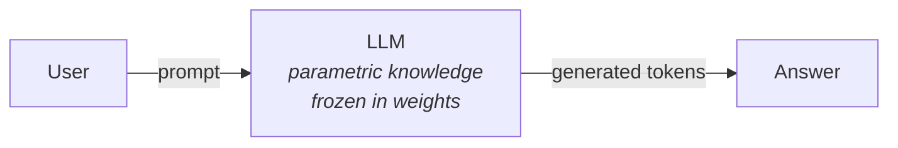
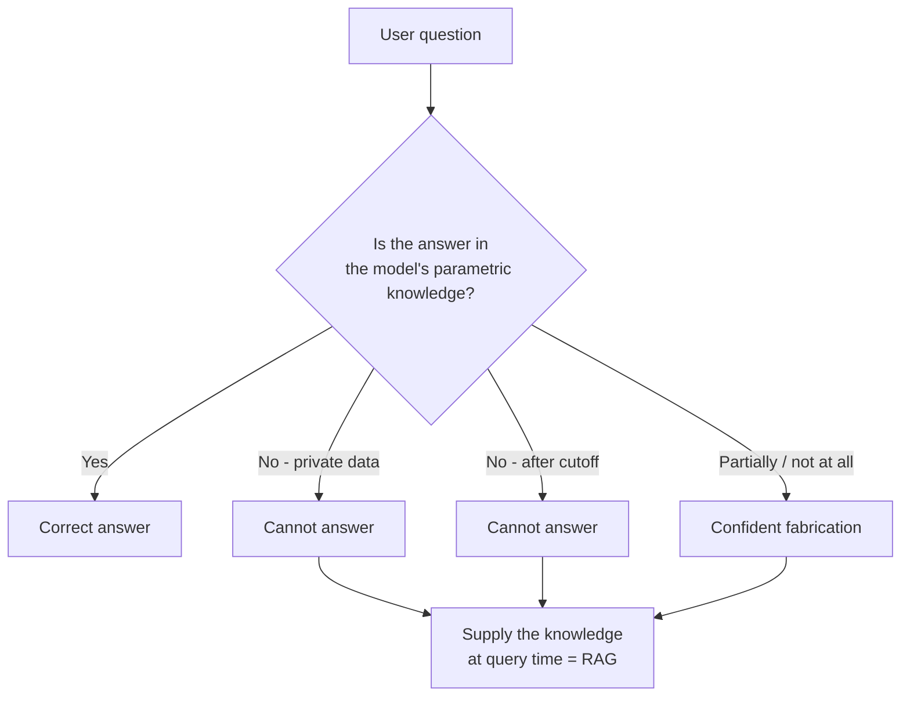

# Why RAG

> Status: `studied` | Section: [Foundations](../README.md)

## What is it?

The case for RAG, built from first principles: what an LLM actually stores, how
that storage is accessed, and the three situations where that access breaks
down.

## Why does it exist?

Start with what an LLM is. A transformer-based neural network with a very large
number of parameters (weights and biases), pre-trained on internet-scale text.

The result of pre-training is that the model's knowledge is **stored in its
parameters** — not in a lookup table, not in a database, but distributed across
billions of numbers. This is called **parametric knowledge**. It is why model
size is used as a proxy for capability: a 70B model can hold more parametric
knowledge than a 13B one, which holds more than a 7B one.

As a user, there is exactly one way to access that knowledge: **prompting**. You
send a prompt, the model interprets it, walks its parametric knowledge, and
generates an answer token by token.

For most questions this works. The three cases below are where it does not.

## Problem it solves

### Problem 1 — Private data

An LLM cannot answer questions about data it never saw during pre-training.

Concrete case: a learning platform hosts long video lectures. A student is
watching one, has a doubt at a specific point, and asks ChatGPT what was
explained there. ChatGPT cannot answer — that video transcript was never part of
its pre-training data.

The same applies to company documentation, internal wikis, personal email,
customer records, and any proprietary corpus. This is not a capability gap in
the model; the information simply is not in it.

### Problem 2 — Recent data (knowledge cutoff)

Every LLM has a **knowledge cutoff date** — the point at which its pre-training
data ends. Ask "what was the biggest news in India today?" and a model whose
cutoff was months ago cannot answer.

> **Additional context.** This is easy to test wrongly. Ask ChatGPT and you will
> often get a correct, current answer — because the product has a web search
> tool wired around the model. The *model* still has a cutoff; the *product*
> works around it. Download a raw open-source model from Hugging Face and ask
> the same question, and the limitation is obvious. Distinguishing the model
> from the product it is wrapped in matters throughout this repository.

### Problem 3 — Hallucination

A model can produce factually incorrect information stated with complete
confidence. For example, asserting that Einstein played football for Germany in
his early years — fluent, plausible, entirely fabricated.

This happens because generation is **probabilistic**. The model is choosing
likely next tokens, not looking facts up. When the parametric knowledge is thin
or absent for a topic, "likely-sounding" and "true" come apart, and nothing in
the architecture prefers the second.

The dangerous property is not the error itself but the confidence: there is no
signal in the output distinguishing a remembered fact from an invented one.

## How it works

RAG addresses all three by attacking the same root cause — the model has no
access to the right information at generation time — rather than three separate
symptoms.

| Problem | How RAG solves it | Cost of the fix |
| --- | --- | --- |
| Private data | The external knowledge base *is* your data, so retrieved context comes from it | Build and maintain an index |
| Recent data | Add the new document to the knowledge base; no retraining | One embedding call per new document |
| Hallucination | Supply exact context and instruct the model to answer only from it, saying "I don't know" otherwise | Extra prompt tokens; still not a guarantee |

The third row is worth stating carefully. RAG **reduces** hallucination by
grounding answers in supplied evidence. It does not eliminate it. A model can
still misread context, blend it with parametric knowledge, or answer confidently
when the context is irrelevant.

## Architecture

Not applicable here — this topic is the motivation. The architecture is in
[03-rag-architecture](../03-rag-architecture/).

## Important concepts

- **Parametric knowledge** — knowledge encoded in weights, fixed at training time.
- **Knowledge cutoff** — the date at which a model's training data ends.
- **Hallucination** — fluent, confident, factually incorrect generation.
- **Grounding** — tying the answer to supplied evidence so it can be checked.

## Mathematical intuition

Not central to this topic, but one framing is useful: an LLM approximates
`P(next token | previous tokens)`. Nothing in that objective rewards truth — it
rewards plausibility. Hallucination is therefore not a bug introduced by a bad
implementation; it is a direct consequence of what the model was optimised for.
Any fix has to come from outside the objective, which is exactly what supplying
verified context does.

## Implementation details

Practical benefits that come out of the architecture rather than the theory:

- **Privacy.** Questions can be asked over confidential documents without
  uploading them to a third-party chat product. With a local embedding model and
  a local vector store, the documents never leave the machine.
- **No document size limit.** A 1 GB corpus cannot be pasted into any context
  window. Chunking plus retrieval means only the few relevant passages are ever
  sent, so corpus size is decoupled from context length.
- **Up-to-date answers.** Freshness becomes an ingestion problem (re-index) not
  a training problem (retrain).

## What I initially misunderstood

<!-- To fill in from my notebook. -->

TODO

## What I learned

- The three problems have one shared cause: the model cannot see the information
  it needs. That reframing is what makes RAG feel inevitable rather than clever.
- Model size does not fix any of the three. A larger model has more parametric
  knowledge, but it still has a cutoff, still has never seen private data, and
  still hallucinates.
- "ChatGPT can answer that" is not evidence that an LLM can. Product features
  hide model limitations.

## Limitations

RAG addresses these three problems. It does not address:

- Reasoning ability — retrieval does not make a weak model reason better.
- Behaviour, tone, output format, or domain style — that is a fine-tuning or
  prompting concern.
- Cases where the answer exists in no document at all.

## When should I use it?

When the failure is one of *missing information*. That is the diagnostic
question: could a knowledgeable colleague answer this if I handed them the right
document? If yes, RAG is the right tool.

## When should I NOT use it?

When the failure is one of *missing capability* — the model has the facts but
cannot reason, format, or behave correctly. Retrieval adds nothing there.

## Related concepts

- [01-what-is-rag](../01-what-is-rag/) — the definition and the four stages
- [04-rag-vs-finetuning](../04-rag-vs-finetuning/) — the alternative fix, and its costs
- [14-rag-evaluation](../../14-rag-evaluation/) — measuring whether hallucination actually went down

## Questions I still have

- How much does RAG actually reduce hallucination, measurably? What does that
  number look like on a real corpus?
- What happens when retrieved context is wrong — does grounding make the error
  *more* convincing than a plain hallucination would have been?

<!-- Add my own questions here. -->
