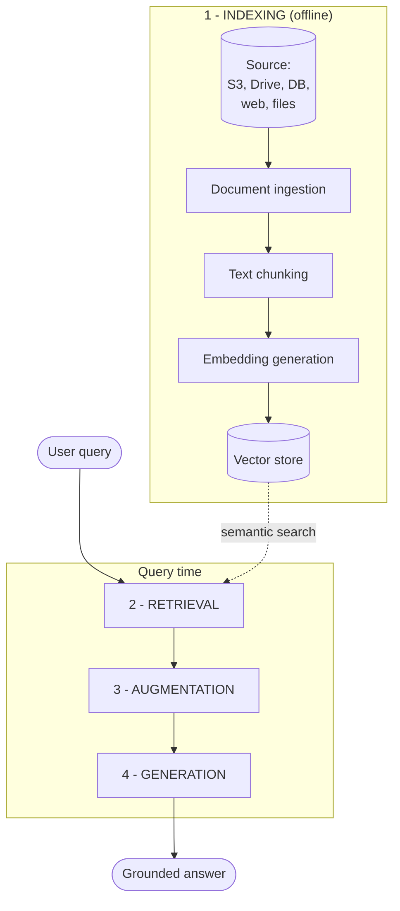
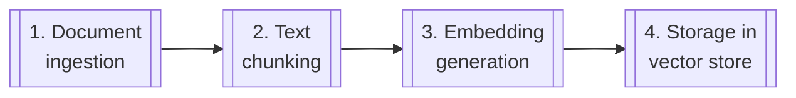
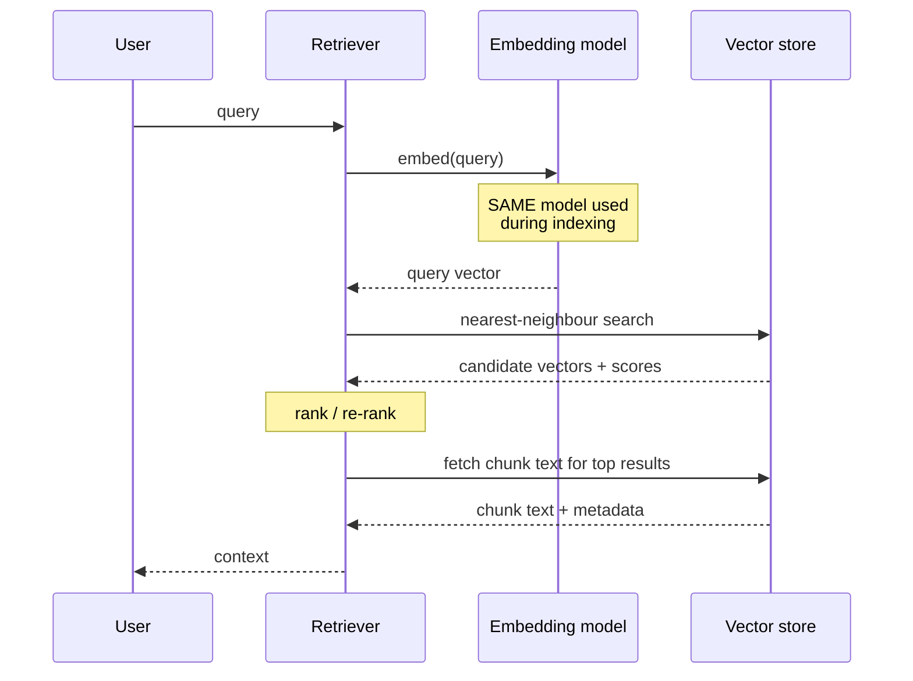

# RAG Architecture

> Status: `studied` | Section: [Foundations](../README.md)

## What is it?

The four stages every RAG system is built from:

| # | Stage | When it runs | What it produces |
| --- | --- | --- | --- |
| 1 | **Indexing** | Offline, once per document | An external knowledge base that can be searched fast |
| 2 | **Retrieval** | Per query | The few chunks most likely to answer the question |
| 3 | **Augmentation** | Per query | A prompt containing the query *and* that context |
| 4 | **Generation** | Per query | The final grounded answer |

Every RAG system — from a 40-line script to a production pipeline — is these
four stages. Advanced RAG changes *how* each stage is done, never *which* stages
exist.



## Why does it exist?

The split between offline and online is the whole point of the architecture.

Searching a large corpus from scratch on every request would be far too slow.
Indexing pays that cost once, ahead of time, so that query time only involves
one embedding call and one nearest-neighbour lookup. This is the same trade that
a database index makes: precompute structure so that reads are cheap.

## Problem it solves

How to select, from a corpus far larger than any context window, the small
subset of text that actually answers this specific question — fast enough to sit
inside a request.

## How it works

### Stage 1 — Indexing

> Indexing is the process of preparing a knowledge base so it can be efficiently
> searched at query time.

Four sub-steps:



**1. Document ingestion.** Load source knowledge into memory. The data lives
somewhere — a server, Google Drive, AWS S3, a database, a website — and the
first job is fetching it and converting it into a common in-memory
representation. In LangChain this is what document loaders do: `PyPDFLoader`,
`WebBaseLoader`, `TextLoader`, YouTube transcript loaders, and hundreds more.
Detail: [02-document-processing/01-document-loading](../../02-document-processing/01-document-loading/).

**2. Text chunking.** Split the loaded document into smaller, semantically
meaningful pieces. Two independent reasons force this:

- *Context length.* There is a hard limit on how many tokens an LLM can accept
  in a prompt. A two-hour lecture transcript or a 300-page book will not fit.
- *Retrieval quality.* Semantic search degrades on large documents. A single
  embedding for a huge, multi-topic document is an average of everything in it,
  which matches nothing precisely.

Chunks should break on meaning, not arbitrarily — one topic per chunk where
possible, not a cut through the middle of a sentence. Tools:
`RecursiveCharacterTextSplitter` (the common default), `SemanticChunker`, and
format-aware splitters for HTML and Markdown.
Detail: [03-chunking](../../03-chunking/).

**3. Embedding generation.** Convert each chunk into a **dense vector** that
captures its meaning. This is what makes the search semantic rather than
keyword-based: similar meanings land near each other in vector space, so a query
phrased differently from the document still matches it. Models: OpenAI
embeddings, sentence-transformers, and others.
Detail: [04-embeddings](../../04-embeddings/).

**4. Storage.** Store each vector **together with its original chunk text and
metadata** in a vector store. The text must be stored alongside the vector —
embeddings cannot be reversed back into text, and it is the text that
eventually goes into the prompt. Local: FAISS, Chroma. Cloud/managed: Pinecone,
Weaviate, Milvus, Qdrant.
Detail: [05-vector-search](../../05-vector-search/).

The output of indexing is the **external knowledge base**.

### Stage 2 — Retrieval

> Retrieval is the real-time process of finding the most relevant pieces of
> information from a pre-built index, based on the user's question.

The mental model: *"of all the knowledge I have, which 3–5 chunks are most
helpful for answering this query?"*



The four things a retriever does:

1. **Embed the query** using *exactly the same embedding model* used for the
   chunks. Same model, same dimension — otherwise the vectors are not comparable
   and the search is meaningless.
2. **Search** the vector store for the vectors closest to the query vector. This
   can be plain similarity search or something more sophisticated (MMR,
   contextual compression — covered in [06-retrieval](../../06-retrieval/)).
3. **Rank** the results, closest first. Simple version: cosine similarity.
   Advanced version: a dedicated reranking model.
4. **Fetch the original text** of the top-ranked chunks. That text is the
   context.

Worked example. A two-hour lecture on linear regression is indexed. The user
asks *"how do we perform the optimization step in gradient descent?"* The
transcript contains chunks about OLS, about multiple linear regression, and two
separate passages about gradient descent (minutes 5–25 and 1:43–1:47).
Retrieval's job is to skip the first two and return the last two — not to send
the whole two-hour transcript.

### Stage 3 — Augmentation

Combine the user's query with the retrieved context into a single prompt. This
is the step that adds knowledge *on top of* the model's parametric knowledge.

```text
You are a helpful assistant.
Answer the question ONLY from the provided context.
If the context is insufficient, just say you don't know.

Context:
{retrieved_chunks}

Question:
{user_question}
```

Augmentation is usually the least code and the most leverage. Chunk ordering,
deduplication, token budgeting and how the context is framed all live here —
see [09-context-engineering](../../09-context-engineering/).

### Stage 4 — Generation

The prompt goes to the LLM, which uses its text-generation ability plus
in-context learning to answer from the supplied context, and returns the
response.

Note what the model is doing here: it is **reading**, not recalling. The heavy
lifting was done by stages 1 and 2.

## Architecture

Where the components from the earlier lessons fit:

| Component | Stage | Role |
| --- | --- | --- |
| Document loaders | Indexing 1 | Source → in-memory documents |
| Text splitters | Indexing 2 | Documents → chunks |
| Embedding models | Indexing 3 + Retrieval 1 | Text → vectors (both sides) |
| Vector stores | Indexing 4 + Retrieval 2 | Persist and search vectors |
| Retrievers | Retrieval | Query → relevant chunks |
| Prompt templates | Augmentation | Query + context → prompt |
| LLM | Generation | Prompt → answer |

## Important concepts

- **Offline vs online split** — indexing is amortised; retrieval is per-request.
- **External knowledge base** — the artefact indexing produces.
- **Symmetry of embedding** — the same model must embed both chunks and queries.
- **Context** — the retrieved text for one specific query, not the whole corpus.
- **Chunk + vector + metadata** — the three things stored per unit.

## Mathematical intuition

Retrieval reduces to a nearest-neighbour problem. With `E` the embedding model,
query `q`, and chunks `c₁…cₙ`:

```
context = top-k over i of  sim( E(q), E(cᵢ) )
```

with cosine similarity:

```
sim(u, v) = (u · v) / (||u|| · ||v||)
```

Two implications for design:

- Cost at query time is dominated by this search, which is why approximate
  nearest neighbour indexes exist ([07-advanced-retrieval](../../07-advanced-retrieval/)).
- `k` is a real trade-off: too small and the answer-bearing chunk is missed; too
  large and the prompt fills with noise that costs tokens and degrades the
  answer.

## Implementation details

- Store the chunk text with the vector. Reconstructing text from an embedding is
  not possible.
- Keep the embedding model fixed for the lifetime of an index. Changing it means
  re-embedding everything — query and chunks must come from one space.
- Metadata attached at ingestion (source, page, timestamp) is what makes
  citation and filtering possible later. Adding it after indexing means
  re-indexing.
- Retrieval returning *something* is not the same as retrieval returning
  something *relevant*. Similarity search always returns the top k, however bad
  the best match is.

## What I initially misunderstood

<!-- To fill in from my notebook. -->

TODO

## What I learned

- The pipeline is two pipelines. Conflating the offline and online halves is the
  fastest way to get confused about where a problem lives.
- Retrieval is the ceiling. Stages 3 and 4 can only work with what stage 2
  handed them.
- "Advanced RAG" does not add stages. It replaces the naive implementation of
  one of these four with a better one.
- The LLM is the last and often the easiest component to swap.

## Limitations

- Every query pays for embedding + search + a larger prompt: latency and cost.
- The index is a snapshot. It is stale the moment a source document changes.
- Similarity is not relevance. Two texts can be near in embedding space and
  still not answer each other.

## When should I use it?

This four-stage pipeline is the correct default for any question-answering
system over a corpus that does not fit in a context window.

## When should I NOT use it?

If the entire corpus fits comfortably in the prompt, skip indexing and retrieval
and pass the whole thing. The pipeline exists to solve a size problem that a
small corpus does not have.

## Related concepts

- [01-what-is-rag](../01-what-is-rag/) — the definition this expands on
- [02-document-processing](../../02-document-processing/) — indexing step 1
- [03-chunking](../../03-chunking/) — indexing step 2
- [04-embeddings](../../04-embeddings/) — indexing step 3
- [05-vector-search](../../05-vector-search/) — indexing step 4
- [06-retrieval](../../06-retrieval/) — stage 2 in depth

## Questions I still have

- Where exactly does reranking sit — inside retrieval, or as a fifth stage?
- How is chunk size chosen for a given corpus, rather than guessed?
- When a document is updated, what is the minimum work needed to keep the index
  correct? (Points at [17-production-rag](../../17-production-rag/).)

<!-- Add my own questions here. -->
