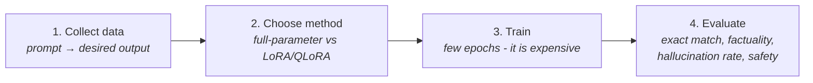
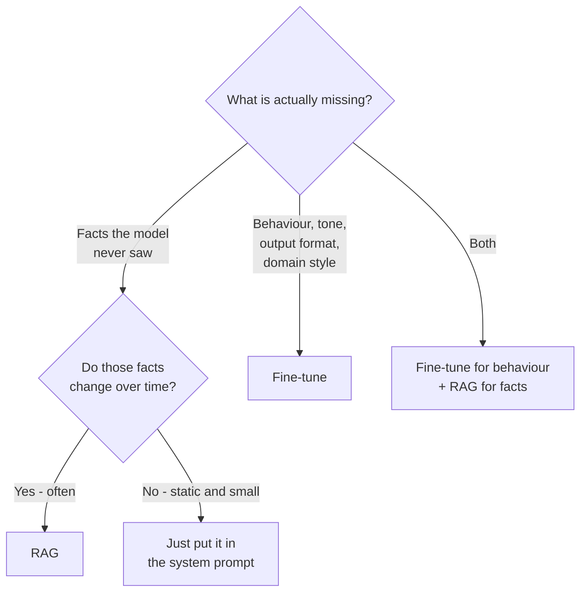

# RAG vs Fine-tuning

> Status: `studied` | Section: [Foundations](../README.md)

## What is it?

Two different ways of getting an LLM to answer questions it could not answer out
of the box:

- **Fine-tuning** — change the model. Take a pre-trained LLM and train it
  further on a smaller, domain-specific dataset so the new knowledge or
  behaviour becomes part of its weights.
- **RAG** — change the prompt. Leave the weights alone and supply the needed
  information at query time.

Historically, fine-tuning was the answer to the three problems in
[02-why-rag](../02-why-rag/). RAG came later as the cheaper answer to the same
problems.

## Why does it exist?

Fine-tuning genuinely solves those problems, but its costs land in exactly the
wrong place for knowledge that changes. Understanding *why* fine-tuning is a bad
fit for changing facts is what makes the case for RAG concrete rather than
fashionable.

## Problem it solves

Choosing correctly between "the model needs new **knowledge**" and "the model
needs new **behaviour**". They look similar from the outside and have completely
different solutions.

## How it works

### Fine-tuning

Take a pre-trained model and continue training it on a smaller domain-specific
dataset. The pre-trained model already has broad general knowledge; fine-tuning
adds the domain.

> **Analogy that made this stick.** An engineering graduate has studied physics,
> chemistry, English and their core subjects — that is pre-training. When they
> join a company, they still get two to three months of onboarding on how *this
> company* works — that is fine-tuning. The general education is not replaced;
> it is specialised.

Main approaches:

| Method | Supervision | What the data looks like |
| --- | --- | --- |
| **Supervised fine-tuning (SFT)** | Labelled | Pairs of `prompt → desired output`. Typically 10k–1M rows. The most commonly used method. |
| **Continued pre-training** | Unsupervised | Raw domain text, no labels — e.g. feeding all your lecture transcripts. Literally continuing pre-training on a smaller corpus. |
| **RLHF** | Human preference | Reinforcement learning from human feedback, used to shape how the model behaves rather than what it knows. |
| **LoRA / QLoRA** | (Not a separate goal) | Parameter-efficient techniques — *how* you fine-tune, not *what* you train on. Base weights are frozen; small adapter weights are trained. |

The SFT process, in four steps:



Step 2 decides step 3's cost. Full-parameter fine-tuning retrains all weights.
LoRA/QLoRA freeze the base weights and train a small set of additional
parameters, which is dramatically cheaper.

### How fine-tuning addresses the three problems

- **Private data** — train on it, and it becomes part of the parametric
  knowledge. This works well.
- **Recent data** — possible but awkward. New information means another
  fine-tuning run, every time.
- **Hallucination** — add training examples showing tricky prompts where the
  correct response is "I don't know", teaching the model to stick to facts
  instead of inventing them.

### Where fine-tuning breaks down

1. **Computationally expensive.** Even on a small dataset, you are training a
   very large model. That costs real money.
2. **Requires expertise.** Running a fine-tune properly needs ML engineers or
   data scientists. It is not a thing most application teams can just do.
3. **Every update means retraining.** Add a course to a catalogue → fine-tune
   again. Remove one → fine-tune again, and now you also have to get the old
   knowledge *out* of the weights, which is far harder than putting it in. In a
   domain where information arrives frequently, fine-tuning is simply not a
   suitable technique.

Point 3 is the decisive one. The cost of fine-tuning scales with *how often
knowledge changes*, and RAG's does not.

## Architecture



The two are not competitors in the general case. Fine-tuning teaches *how to
behave*; RAG supplies *what to know*. Production systems often use both.

## Important concepts

- **Parametric vs non-parametric knowledge** — in the weights vs in a store.
- **Full-parameter vs parameter-efficient fine-tuning** — retrain everything vs
  freeze the base and train adapters (LoRA / QLoRA).
- **Knowledge deletion** — trivial in RAG (delete the document), very hard in a
  fine-tuned model.
- **Update frequency** — the variable that decides between the two.

## Mathematical intuition

Not a formula, but a cost model worth carrying around:

```
Fine-tuning cost  ≈  training_run_cost  ×  number_of_knowledge_updates
RAG cost          ≈  embedding_cost_per_new_document
                     +  (retrieval + extra prompt tokens) × number_of_queries
```

Fine-tuning front-loads cost and pays again on every knowledge change.
RAG has near-zero update cost and pays a small amount on every query instead.
Which is cheaper depends on the ratio of updates to queries — but for most
knowledge-heavy applications, updates are what hurt.

## Implementation details

| Dimension | Fine-tuning | RAG |
| --- | --- | --- |
| Knowledge lives in | Model weights | External vector store |
| Adding knowledge | Retrain | Insert a document |
| Removing knowledge | Retrain, and hard to guarantee | Delete a document |
| Cost profile | High up-front, repeated per update | Low up-front, small per query |
| Expertise needed | ML engineering | Application engineering |
| Data needed | Labelled dataset (SFT: 10k–1M rows) | The raw documents, as they are |
| Latency at query time | Normal | Higher — retrieval happens first |
| Answer traceability | None — knowledge is diffuse | Direct — the source chunk is known |
| Good at | Behaviour, style, format, domain tone | Facts, freshness, private data |

The practical summary: RAG is the **cheaper and simpler** alternative for
knowledge problems. There is no training, no labelled dataset to curate — the
company's documents go into a vector store as they are.

## What I initially misunderstood

<!-- To fill in from my notebook. -->

TODO

## What I learned

- Fine-tuning is not obsolete, and RAG did not replace it. They solve different
  problems that are easy to confuse.
- The right question is never "RAG or fine-tuning?" but "is what's missing
  knowledge or behaviour?"
- Removing knowledge is the asymmetry nobody mentions first. RAG deletes a row;
  fine-tuning cannot cleanly forget.
- LoRA/QLoRA are about *cost of training*, not about *what is learned*. They do
  not change the update-frequency problem.

## Limitations

- The comparison table above is directional, not measured. On a specific task
  with a specific corpus, the only honest answer comes from an experiment.
- "Use both" is the standard production answer, and it doubles the surface area
  of things that can go wrong.

## When should I use it?

**Choose RAG when:** the facts are private, the facts change, the corpus is
large, answers must cite sources, or there is no ML engineering capacity.

**Choose fine-tuning when:** the model must consistently behave, format or speak
in a particular way; the domain language differs sharply from general text; or
latency budget cannot absorb a retrieval step.

**Choose both when:** the application needs domain behaviour *and* current
facts.

## When should I NOT use it?

Do not fine-tune to inject facts that change weekly — that is the specific case
fine-tuning handles worst. Do not reach for RAG to fix tone or output format;
there is nothing to retrieve.

## Related concepts

- [02-why-rag](../02-why-rag/) — the three problems both techniques target
- [03-rag-architecture](../03-rag-architecture/) — what RAG costs at query time
- [14-rag-evaluation](../../14-rag-evaluation/) — how this choice would actually be settled with evidence

## Questions I still have

- At what corpus size or update frequency does fine-tuning become the cheaper
  option, concretely?
- Does fine-tuning on a domain make a model *better at reading retrieved
  context* from that domain?
- How is knowledge actually removed from a fine-tuned model in practice?

<!-- Add my own questions here. -->
