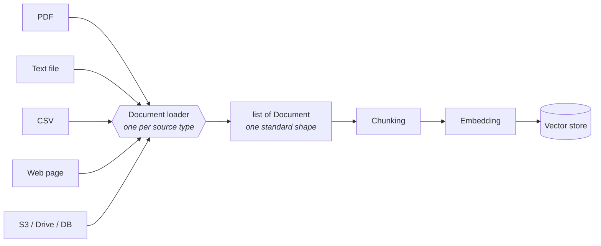
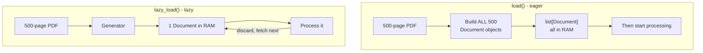

# Document Loading

> Status: `studied` | Section: [Document Processing](../README.md)

## What is it?

The first step of indexing: fetching source data from wherever it lives and
converting it into one standard in-memory representation that the rest of the
pipeline can work with.

> Document loaders are components used to load data from various sources into a
> standardised format — usually `Document` objects — which can then be used for
> chunking, embedding, retrieval and generation.

## Why does it exist?

Source data is scattered across formats and locations: PDFs, text files, CSVs,
databases, S3, Google Drive, Dropbox, web pages, YouTube transcripts, Slack,
Git repositories. Hundreds of possible sources.

If every downstream component had to understand every source format, the
pipeline would be unbuildable. The fix is a **standardised intermediate
representation**: whatever the source, loading produces the same object type, so
splitters, embedders and retrievers only ever have to handle one shape.



This is an adapter pattern: many inputs, one output contract.

## Problem it solves

Decoupling *where data comes from* from *what the pipeline does with it*.
Swapping a PDF source for a web source should change one line, not the pipeline.

## How it works

### The `Document` object

Every loader returns the same thing, and it has exactly two parts:

| Field | Contains |
| --- | --- |
| `page_content` | The actual text, as a string |
| `metadata` | Everything *about* the text — source path, page number, creation date, author, row number, … |

That is the whole contract. See [03-metadata](../03-metadata/) for why the second
field matters more than it looks.

### Every loader returns a *list*

This is the single most important behavioural detail, and it is easy to miss:
loaders return `list[Document]`, never a single `Document` — even when there is
only one.

What determines the list length is loader-specific, and it is really a policy
decision about what "one document" means for that source:

| Loader | Splitting policy | 
| --- | --- |
| `TextLoader` | Whole file → **1** document |
| `PyPDFLoader` | **1 document per page** — a 23-page PDF gives 23 documents |
| `CSVLoader` | **1 document per row** — a 400-row CSV gives 400 documents |
| `WebBaseLoader` | **1 document per URL** — pass a list of URLs, get one per URL |
| `DirectoryLoader` | Delegates to another loader, concatenating results |

> **Technical note.** This is *not* chunking. It is the loader's natural unit of
> the source (a page, a row, a file). Chunking is a separate, deliberate step
> that happens afterwards and is driven by embedding and context-window
> constraints, not by document structure. A 23-page PDF is 23 documents after
> loading and will still need splitting.

### The four loaders worth knowing first

All of them live in the `langchain_community.document_loaders` package, and all
of them have the same usage shape: construct the loader, call `.load()`.

**1. `TextLoader`** — the simplest one. Reads a text file into a single
document. Used for log files, code snippets, transcripts. Takes a file path and
optionally an `encoding` (specify `utf-8` when the file contains special
characters).

**2. `PyPDFLoader`** — the most used one. Reads a PDF page by page. Internally
it uses the `pypdf` library, which is why it works well on ordinary text-based
PDFs and poorly on scanned or complex-layout ones.

For PDFs it cannot handle, pick a different loader by the *problem*, not by
preference:

| Situation | Loader |
| --- | --- |
| Ordinary text-based PDF | `PyPDFLoader` |
| Lots of tables to extract | `PDFPlumberLoader` |
| Scanned / image-only PDF | `UnstructuredPDFLoader`, `AmazonTextractPDFLoader` |
| Complex layouts | `PyMuPDFLoader` |
| Structure extraction | `UnstructuredPDFLoader` |

**3. `WebBaseLoader`** — loads and extracts text content from web pages.
Internally it uses two Python libraries: `requests` to make the HTTP request,
and `BeautifulSoup` to parse the HTML and strip the tags down to text. Works
well on static pages — blogs, news articles, documentation. It does **not**
handle JavaScript-heavy pages where content is rendered client-side; that needs
a browser-driven loader such as `SeleniumURLLoader`.

**4. `CSVLoader`** — one document per row. `page_content` becomes a string of
`column: value` pairs and `metadata` carries the source file and row number.
Useful when rows are independently meaningful records.

### `DirectoryLoader` — loading a folder

For a folder of files rather than one file. Three parameters do the work:

| Parameter | Purpose |
| --- | --- |
| `path` | The directory to load from |
| `glob` | Which files to pick, as a pattern |
| `loader_cls` | Which loader class to apply to each matched file |

Common glob patterns:

| Pattern | Meaning |
| --- | --- |
| `*.pdf` | All PDFs in the root directory |
| `**/*.txt` | All text files, including sub-directories |
| `data/*.csv` | All CSVs inside `data/` |
| `**/*` | Every file in every sub-directory |

It composes with any other loader, so the same mechanism works for text, CSV or
PDF folders.

Worth checking the arithmetic once, because it makes the model concrete: three
ML books of 326, 392 and 468 pages loaded with `DirectoryLoader` +
`PyPDFLoader` produce **1186** documents — the sum of the page counts. Indexing
is zero-based, so document `0` is book 1 page 1, document `325` is book 1's last
page, and document `326` is book 2's first page.

### `load()` vs `lazy_load()` — eager vs lazy

Every loader has both. They do the same job with completely different memory
behaviour.



| | `load()` | `lazy_load()` |
| --- | --- | --- |
| Strategy | Eager — everything at once | On demand — one document at a time |
| Returns | `list[Document]` | **Generator** of `Document` |
| Memory | All documents held in RAM | One document at a time |
| First output | Only after everything is loaded | Almost immediately |
| Use when | Few / small files, and you need random access | Many or large files, or streaming processing |

The observable difference: loading three PDFs eagerly and printing each
document's metadata produces a long pause with no output, then a burst. The lazy
version starts printing immediately and proceeds at a steady rate, because each
document is created, used, and discarded before the next one is read.

The reason this matters is not speed — total work is similar — it is that eager
loading has a hard ceiling. Three PDFs fit in RAM. Five hundred do not.

### Custom loaders

If no loader exists for a source, you write one: subclass the base loader class
and implement `lazy_load()` (and `load()`). That extension point is exactly why
LangChain has hundreds of loaders — the community wrote them for their own use
cases and contributed them back, which is also why they all live in the
`langchain_community` package rather than the core one.

## Architecture

Where loading sits:


## Important concepts

- **`Document`** — the standard unit: `page_content` + `metadata`.
- **`list[Document]`** — always a list, never a bare document.
- **Loader splitting policy** — per file / per page / per row / per URL.
- **Eager vs lazy loading** — list vs generator; RAM ceiling vs streaming.
- **Glob pattern** — which files a `DirectoryLoader` picks up.
- **`loader_cls`** — how `DirectoryLoader` composes with other loaders.

## Mathematical intuition

Not applicable — this is I/O and data modelling, not maths. The only quantitative
relationship worth holding on to is the memory one:

```
eager:  peak_memory ≈ total_size_of_all_documents
lazy:   peak_memory ≈ size_of_one_document
```

which is the difference between a pipeline that scales with corpus size and one
that does not.

## Implementation details

- All loaders come from `langchain_community.document_loaders`.
- `PyPDFLoader` needs `pypdf` installed separately (`pip install pypdf`), and
  fails without it.
- `TextLoader(path, encoding="utf-8")` — specify the encoding when the file has
  special characters; often unnecessary otherwise.
- The output plugs straight into a chain: extract `docs[0].page_content` and
  pass it as a prompt variable. Wrapping the load step in a `RunnableLambda`
  makes the loader itself part of the chain.
- Reading every loader's documentation is not useful. Learn the shared contract
  — construct, `.load()`, get `list[Document]` — and look up specific loaders
  per project when a source actually requires one.

## What I initially misunderstood

<!-- To fill in from my notebook. -->

TODO

## What I learned

- The `Document` abstraction is the entire point. Everything else in this topic
  is a detail of how a particular source gets converted into it.
- A loader's "one document" unit is a design decision, not a fact about the
  file. Knowing which unit each loader uses predicts the list length before
  running anything.
- Loading is not chunking. A per-page split is not a semantic split.
- `lazy_load()` is not an optimisation to add later — it is the difference
  between a pipeline that survives a real corpus and one that dies at 500 PDFs.
- The right amount to learn about loaders is: the contract, plus four of them.
  The rest is documentation lookup.

## Limitations

- `PyPDFLoader` degrades badly on scanned documents and complex layouts —
  extraction can produce jumbled reading order or nothing at all.
- `WebBaseLoader` sees only server-rendered HTML; JavaScript-rendered content is
  invisible to it.
- Loaders extract text, not structure. Headings, tables and reading order are
  largely lost — recovering them is [02-document-parsing](../02-document-parsing/).
- Load failures are silent in a damaging way: an empty or garbled
  `page_content` still flows through chunking and embedding without error, and
  only shows up as bad retrieval much later.

## When should I use it?

Always — it is unconditionally the first step of indexing. The real decisions
are *which* loader and *whether* to load lazily.

## When should I NOT use it?

Not applicable as a stage. But do not use a framework loader when the source is
trivial and a few lines of Python are clearer — a loader that hides
`open(path).read()` behind an abstraction adds a dependency and no
understanding.

## Related concepts

- [02-document-parsing](../02-document-parsing/) — recovering structure, not just text
- [03-metadata](../03-metadata/) — the second half of every `Document`
- [03-chunking](../../03-chunking/) — what happens to these documents next
- [01-foundations/03-rag-architecture](../../01-foundations/03-rag-architecture/) — where this sits in the pipeline
- [13-multimodal-rag/06-ocr](../../13-multimodal-rag/06-ocr/) — the scanned-PDF problem, properly

## Questions I still have

- How do I detect a *bad* load (empty or garbled text) automatically, before it
  poisons the index?
- For a folder mixing PDFs, CSVs and text files, is one `DirectoryLoader` per
  type the standard approach?
- Does per-page loading hurt retrieval when a concept spans a page boundary?

<!-- Add my own questions here. -->
