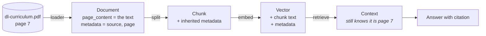

# Metadata

> Status: `partially studied` — covered so far only as the second half of the
> `Document` object in the document-loaders lesson. The dedicated material on
> metadata filtering and citation has not been studied yet.
>
> Section: [Document Processing](../README.md)

## What is it?

The second field of every `Document`. `page_content` holds the text; `metadata`
holds everything *about* that text — where it came from, which page or row it
was, when it was created, who wrote it.

It is populated automatically by the loader at ingestion time, and it travels
with the chunk through splitting, embedding and storage.

## Why does it exist?

The embedding of a chunk captures what the text *means*. It captures nothing
about where the text came from. Without metadata, a retrieved chunk is an
anonymous paragraph — correct, perhaps, but unattributable and unfilterable.

Metadata is what makes three things possible later:

- **Citation** — "this answer comes from `dl-curriculum.pdf`, page 7"
- **Filtering** — restrict retrieval by source, date, author or permission
- **Debugging** — when an answer is wrong, trace which document caused it

## Problem it solves

Turning retrieval output from *text* into *evidence*.

## How it works

Each loader attaches what it knows about the source:

| Loader | Typical metadata |
| --- | --- |
| `TextLoader` | `source` (file path) |
| `PyPDFLoader` | `source`, `page`, `total_pages`, `producer`, `creator`, `creationdate`, `title` |
| `CSVLoader` | `source`, `row` |
| `WebBaseLoader` | `source` (the URL), page title |
| `DirectoryLoader` | Whatever the delegated loader produces — `source` identifies which file in the folder |

Reading it is just attribute access:

```python
docs[0].page_content   # the text
docs[0].metadata       # the dict describing it
```

With `DirectoryLoader` over three books, `docs[326].metadata` identifies both
*which* book and *which page within it* — the only reason a flat list of 1186
documents remains interpretable.



The point of the diagram is that metadata is the *only* thing that survives the
whole pipeline unchanged. Text gets split, meaning gets compressed into a
vector, but `source` and `page` pass through intact.

## Architecture

Metadata is set at ingestion and consumed at retrieval — the two ends of the
pipeline, with everything in between just carrying it.

## Important concepts

- **`source`** — present in essentially every loader's metadata; the minimum
  needed for citation.
- **Positional metadata** — `page`, `row`: locates the chunk inside the source.
- **Inheritance** — chunks inherit the metadata of the document they came from.

## Mathematical intuition

Not applicable.

## Implementation details

- Metadata is a plain dict and can be extended with custom keys at ingestion —
  tenant, permission level, ingest timestamp, document version.
- Add it at ingestion. Adding metadata after indexing means re-indexing, because
  it is stored alongside the vector.

## What I initially misunderstood

<!-- To fill in from my notebook. -->

TODO

## What I learned

- Metadata is not incidental bookkeeping. It is what makes a RAG answer
  checkable rather than merely fluent.
- It is decided at ingestion time, which means ingestion is where citation,
  filtering and access control are actually designed.

## Limitations

- Metadata is only as good as the source. PDFs often carry wrong or missing
  `title` / `author` fields.
- Filtering on metadata interacts with approximate vector indexes in
  non-obvious ways — a topic in [05-vector-search](../../05-vector-search/).

## When should I use it?

Always capture at least `source`. Everything downstream that needs to explain
itself depends on it.

## When should I NOT use it?

<!-- Not yet studied - to fill in. -->

TODO

## Related concepts

- [01-document-loading](../01-document-loading/) — where metadata comes from
- [05-vector-search/04-metadata-filtering](../../05-vector-search/04-metadata-filtering/) — using it at query time
- [14-rag-evaluation/14-citation-correctness](../../14-rag-evaluation/14-citation-correctness/) — verifying it

## Questions I still have

- Which metadata fields actually get used in a production RAG system, versus
  which are just carried around?
- How is access control usually encoded in metadata?

<!-- Add my own questions here. -->
