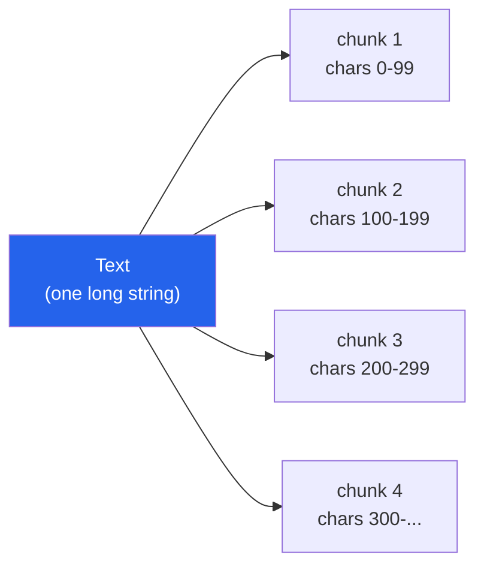
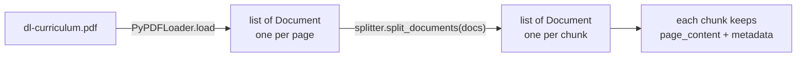

# Fixed-Size Chunking

> Status: `studied` | Section: [Chunking](../README.md)

## What is it?

Length-based splitting: decide a chunk size up front, walk the text from the
start, and cut every time the counter reaches that size. Nothing about the
content influences where the cut lands.

The size can be counted in **characters** or in **tokens**. The idea is
identical; only the unit changes.



## Why does it exist?

It is the simplest thing that works, and it is the baseline every other strategy
is measured against. Conceptually trivial, trivial to implement, and very fast —
one pass over the string with a counter.

## Problem it solves

Getting a document under a model's input limit, with no analysis of the text at
all.

## How it works

1. Fix a chunk size, say 100 characters.
2. Traverse the text from the beginning, counting.
3. At 100, cut. That is chunk 1.
4. Resume from exactly where you stopped and repeat.
5. Whatever is left at the end becomes the final (shorter) chunk.

Increase the chunk size and you get fewer chunks; decrease it and you get more.
That is the whole algorithm.

## Architecture

In LangChain this is `CharacterTextSplitter`:

```python
from langchain_text_splitters import CharacterTextSplitter

splitter = CharacterTextSplitter(
    chunk_size=100,
    chunk_overlap=0,
    separator="",      # see the technical note below - this matters
)

chunks = splitter.split_text(text)   # -> list[str]
```

> **Technical note — verified against `langchain_text_splitters` 1.1.2.**
> `CharacterTextSplitter`'s **default separator is `"\n\n"`, not `""`**. Out of
> the box it is a *paragraph* splitter that merges paragraphs up to
> `chunk_size`, not a pure length splitter. Passing `separator=""` is what
> produces the plain fixed-size behaviour described above.
>
> This has a consequence worth knowing: the splitter divides on the separator
> **first**, then merges the pieces up to `chunk_size`. A piece that is already
> bigger than `chunk_size` cannot be made smaller, so **`chunk_size` gets
> exceeded**. It is a merge budget, not a hard cap.
>
> Measured, three cases:
>
> | Input | `chunk_size` | Result |
> | --- | --- | --- |
> | 300-char paragraph, no `\n\n` anywhere | 50 | **1 chunk of 299 chars, no warning at all** |
> | Two paragraphs of 187 and 160 chars | 100 | 2 oversized chunks, plus a logged `WARNING: Created a chunk of size 187, which is longer than the specified 100` |
> | Same 300-char paragraph, but `RecursiveCharacterTextSplitter` | 50 | 6 chunks, longest 49 — budget respected |
>
> So the failure is sometimes announced and sometimes not, and it is a logging
> warning rather than an exception either way. The recursive splitter does not
> have this problem because its separator list ends in `""`, giving it a level
> it can always fall back to.

Other defaults on the base class: `chunk_size=4000`, `chunk_overlap=200`,
`length_function=len`, `strip_whitespace=True`.

### The three methods

| Method | Input | Output |
| --- | --- | --- |
| `split_text(str)` | a raw string | `list[str]` |
| `create_documents(list[str])` | raw strings | `list[Document]` |
| `split_documents(list[Document])` | loader output | `list[Document]` |

`split_documents` is the one that connects to the previous topic: feed it the
`Document` objects a loader returned and every chunk comes back as a `Document`
too, with `page_content` and inherited `metadata`.



## Important concepts

- **chunk_size** — the budget, in characters or tokens.
- **separator** — what `CharacterTextSplitter` divides on before merging.
- **Token vs character** — tokens and words are *not* the same thing, though it
  is convenient to treat them as roughly equal when reasoning about limits.
  For real token counting, `CharacterTextSplitter.from_tiktoken_encoder(...)`
  counts with the model's tokenizer instead of `len`.

## Mathematical intuition

For pure length splitting with no overlap:

```
number_of_chunks = ceil(len(text) / chunk_size)
```

Chunk count is inversely proportional to chunk size. Every chunk is exactly
`chunk_size` except the last.

## Implementation details

- Import from `langchain_text_splitters` (the current package). Older material
  uses `langchain.text_splitter`, which still re-exports these classes.
- `split_text` returns plain strings; the metadata is lost. Use
  `split_documents` when the chunks came from a loader and provenance matters.

## What I initially misunderstood

<!-- To fill in from my notebook. -->

TODO

## What I learned

- The simplicity is the entire value proposition, and also the entire problem.
- `CharacterTextSplitter` is not really "the fixed-size splitter" — it is a
  separator splitter whose default happens to be paragraphs. The pure
  fixed-size behaviour is a special case you opt into with `separator=""`.
- `chunk_size` is not a guarantee. It is respected during merging, not enforced
  on the output.

## Limitations

This method looks at **none** of the following when deciding where to cut:

- linguistic structure (paragraphs, sentences)
- grammar
- semantic meaning

If the counter hits 100 in the middle of a word, it cuts in the middle of the
word. In practice cuts land mid-word, mid-sentence and mid-paragraph.

The damage is downstream: information about one idea ends up split across two
chunks, so *neither* chunk's embedding captures it properly. Half the context is
in chunk 1, half in chunk 2, and each vector represents a fragment.

This is why length-based splitting, despite being the fastest, is rarely the one
actually used.

## When should I use it?

- A quick baseline to compare better strategies against.
- Text with no meaningful structure at all (log lines, sensor dumps).
- When throughput matters far more than retrieval quality.

## When should I NOT use it?

Prose, documentation, transcripts, code — anything where the text has a
structure worth preserving. Use
[recursive chunking](../02-recursive-chunking/) instead; it costs almost nothing
extra and respects boundaries.

## Related concepts

- [02-recursive-chunking](../02-recursive-chunking/) — the structure-aware upgrade
- [03-chunk-size](../03-chunk-size/) — choosing the number
- [04-chunk-overlap](../04-chunk-overlap/) — softening the cut
- [05-chunking-strategies](../05-chunking-strategies/) — where this sits among the four

## Questions I still have

- When is token-based sizing worth the extra dependency over character-based?
- Is there a case where a mid-sentence cut is genuinely harmless?

<!-- Add my own questions here. -->
