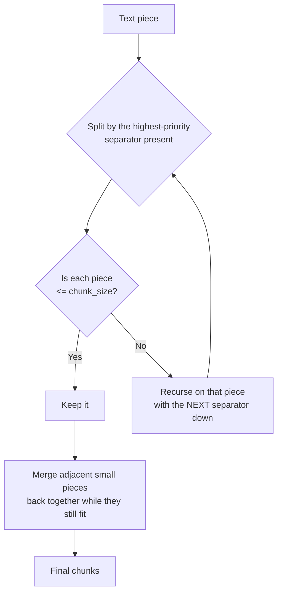

# Recursive Chunking

> Status: `studied` | Section: [Chunking](../README.md)

## What is it?

Text-structure-based splitting. It exploits the fact that written text is
already organised as a hierarchy:

```
document → paragraphs → sentences / lines → words → characters
```

The splitter tries to cut at the **largest** structural boundary first. Only if
the resulting piece is still too big does it drop to the next level down.

In LangChain this is `RecursiveCharacterTextSplitter`, and it is the splitter
used most in practice.

## Why does it exist?

[Fixed-size chunking](../01-fixed-size-chunking/) cuts wherever the counter runs
out, splitting words and sentences in half. Recursive splitting keeps the
biggest intact unit that fits, so chunks tend to be whole paragraphs, or whole
sentences, rather than fragments.

## Problem it solves

Staying under a size limit **without** destroying the structure that carries
meaning.

## How it works

A list of separators is defined in priority order. The verified default:

```python
["\n\n", "\n", " ", ""]
```

| Separator | Represents |
| --- | --- |
| `"\n\n"` | paragraphs |
| `"\n"` | lines / sentences |
| `" "` | words |
| `""` | individual characters (last resort) |

The algorithm:



The **merge step** is the part that is easy to miss and does a lot of the work.
After splitting down to small units, the splitter greedily rejoins neighbouring
pieces while the total stays within `chunk_size` — otherwise splitting to word
level would return one word per chunk.

### Worked example

```text
My name is Nitish
I am 35 years old

I live in Gurgaon
How are you?
```

Character counts (measured, not eyeballed): the first three lines are 17 each,
the last is 12. Including the newline that joins them, paragraph 1 is **35**
characters and paragraph 2 is **30**.

**`chunk_size=10`**

1. Split on `"\n\n"` → two paragraphs (35, 30). Both exceed 10 → recurse.
2. Split on `"\n"` → four lines (17, 17, 17, 12). All exceed 10 → recurse.
3. Split on `" "` → individual words. All fit.
4. Merge: `My`(2) + `name`(4) → `My name`(7); + `is`(2) → `My name is`(10).
   Adding `Nitish` would make 17 > 10, so stop there.

```text
['My name is', 'Nitish', 'I am 35', 'years old',
 'I live in', 'Gurgaon', 'How are', 'you?']
```

**`chunk_size=25`** — paragraphs are too big, lines fit, and no two lines can be
merged (17 + 17 + 1 = 35 > 25):

```text
['My name is Nitish', 'I am 35 years old', 'I live in Gurgaon', 'How are you?']
```

**`chunk_size=50`** — both paragraphs already fit, and merging them would give
35 + 30 + 2 = 67 > 50:

```text
['My name is Nitish\nI am 35 years old', 'I live in Gurgaon\nHow are you?']
```

> Verified: these three outputs are exactly what
> `langchain_text_splitters` 1.1.2 produces for this input.

The pattern to take away: **as `chunk_size` grows, the split level rises.**
Tiny sizes force word- or character-level cuts; larger sizes let whole
sentences, then whole paragraphs, survive. Set it to 1 and it must cut every
character; set it very large and the whole text is one chunk.

Notice too that even at `chunk_size=10` — far too small for these lines — it
never cut inside a word. It dropped a level instead, which is precisely what
fixed-size splitting cannot do.

> **Technical note — the guarantee is conditional.** That holds here only
> because every word in this example is 10 characters or fewer. When a single
> word is *longer* than `chunk_size`, the separator list falls through to `""`
> and the word does get cut. Measured on a different sample: at
> `chunk_size=10`, `RecursiveCharacterTextSplitter` produced 7 mid-word cuts
> because words like "exploration" (11) and "discoveries." (12) cannot fit in
> the budget at all. At `chunk_size=25` and above on the same text, mid-word
> cuts dropped to zero.
>
> So the property is not "never cuts words" but "never cuts a word it could
> have avoided cutting". Fixed-size splitting on the same text cut mid-word 19
> times at size 10 and was still cutting at size 200.

## Architecture

```python
from langchain_text_splitters import RecursiveCharacterTextSplitter

splitter = RecursiveCharacterTextSplitter(
    chunk_size=100,
    chunk_overlap=0,
)

chunks = splitter.split_text(text)          # -> list[str]
docs   = splitter.split_documents(documents) # -> list[Document]
```

Constructor parameters (verified): `separators=None` (defaults to the list
above), `keep_separator=True`, `is_separator_regex=False`, plus the base
options `chunk_size=4000`, `chunk_overlap=200`, `length_function=len`,
`add_start_index=False`, `strip_whitespace=True`.

The same class also handles **code and Markdown** through
`.from_language(...)`, which swaps in format-specific separators — see
[05-chunking-strategies](../05-chunking-strategies/).

## Important concepts

- **Separator priority list** — the structural hierarchy, largest unit first.
- **Recursion** — only pieces that are still too large get split further.
- **Merge / optimise step** — small neighbouring pieces are rejoined up to
  `chunk_size`.
- **Graceful degradation** — it drops a level only when forced.

## Mathematical intuition

Not a formula, but the invariant is worth stating: the splitter returns the
**coarsest** decomposition of the text in which every piece fits the budget.
Chunk count is therefore driven by the structure of the text as much as by
`chunk_size` — the same size applied to dense prose and to short lines produces
very different results.

## Implementation details

- Unlike `CharacterTextSplitter`, the `""` fallback at the end of the separator
  list means this splitter can *always* get under `chunk_size` — there is
  always a level left to drop to.
- `keep_separator` defaults to `True` here (and `False` on the base class), so
  separators are retained in the output by default.
- `add_start_index=True` records each chunk's offset in the source as
  `start_index` metadata — useful for citation later.

## What I initially misunderstood

<!-- To fill in from my notebook. -->

TODO

## What I learned

- "Recursive" refers to descending the separator list, not to anything about
  the text.
- The merge step is half the algorithm. Without it, small `chunk_size` values
  would return one word per chunk.
- `chunk_size` does not just control size — it selects which structural level
  the split lands on. That is a much more useful way to think about the number.
- Implementing it from scratch and getting output identical to the library was
  the moment it stopped being magic.

## Limitations

- It respects *structure*, not *meaning*. A single paragraph covering two
  unrelated topics stays one chunk, because structurally it is one paragraph.
  That is the gap [semantic chunking](../05-chunking-strategies/) targets.
- It depends on the text actually having the separators. Text with no blank
  lines collapses straight to line or word level.

## When should I use it?

As the default for prose, documentation and transcripts. It is the recommended
starting point, and the extra cost over fixed-size splitting is negligible.

## When should I NOT use it?

- When a paragraph reliably mixes unrelated topics — consider semantic
  splitting.
- For code or Markdown, use `.from_language(...)` so the separators match the
  format's real constructs.

## Related concepts

- [01-fixed-size-chunking](../01-fixed-size-chunking/) — what this improves on
- [03-chunk-size](../03-chunk-size/) — the parameter that selects the split level
- [04-chunk-overlap](../04-chunk-overlap/) — the other parameter
- [05-chunking-strategies](../05-chunking-strategies/) — `from_language`, semantic splitting

## Questions I still have

- How do I pick `chunk_size` for a corpus rather than guessing and eyeballing?
- Does `keep_separator=True` vs `False` measurably change retrieval quality?

<!-- Add my own questions here. -->
