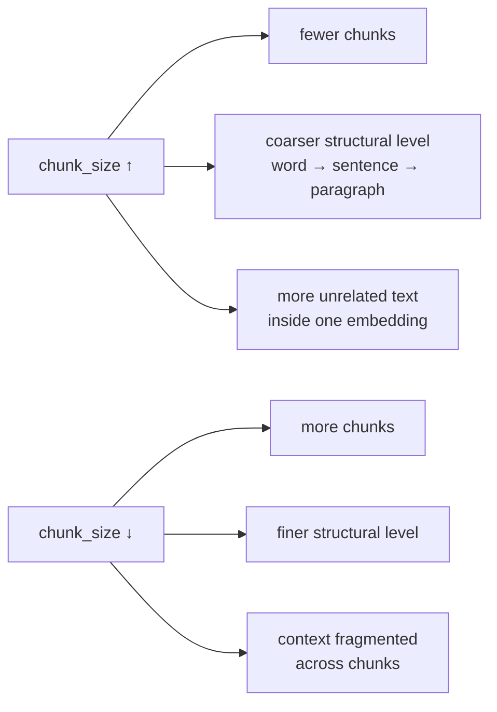

# Chunk Size

> Status: `studied` | Section: [Chunking](../README.md)

## What is it?

`chunk_size` — the maximum size of a single chunk, measured in characters by
default, or in tokens if a token-counting length function is used.

It is the parameter with the largest effect on a RAG pipeline, and there is no
correct value independent of the corpus.

## Why does it exist?

Something has to bound the pieces, because the whole point of splitting is to
get under a model's input limit. `chunk_size` is that bound.

## Problem it solves

Turning "make the pieces small enough" into a single number a splitter can act
on.

## How it works

The direct effect is arithmetic: larger size → fewer chunks, smaller size →
more chunks.

The more useful effect shows up with
[recursive splitting](../02-recursive-chunking/), where `chunk_size` decides
**which structural level the split lands on**. On the same four-line text:

| `chunk_size` | Splits at | Chunks |
| --- | --- | --- |
| 10 | word level | 8 |
| 25 | sentence / line level | 4 |
| 50 | paragraph level | 2 |

So the number is not really "how big should a chunk be" but "what unit of text
do I want a chunk to be".

The same effect on a Markdown document with four logical sections: at a very
small size it produced 64 meaningless chunks; raising it improved things
gradually, and at 175 it produced exactly the four sections that were actually
there.



## Architecture

Not a component — a constructor argument on every splitter:

```python
RecursiveCharacterTextSplitter(chunk_size=300, chunk_overlap=0)
```

The LangChain default is `chunk_size=4000` (with `chunk_overlap=200`), which is
much larger than what RAG pipelines typically use.

## Important concepts

- **Unit** — characters by default (`length_function=len`); tokens via
  `from_tiktoken_encoder(...)`. Tokens and words are not the same, so a chunk
  size in characters and one in tokens are not interchangeable.
- **Budget, not guarantee** — with `CharacterTextSplitter`, `chunk_size` can be
  silently exceeded when the separator is absent. `RecursiveCharacterTextSplitter`
  can always get under it because it falls back to character level.

## Mathematical intuition

For length-based splitting with no overlap:

```
number_of_chunks ≈ ceil(len(text) / chunk_size)
```

For recursive splitting this is only an upper bound — actual counts depend on
where the separators fall.

The trade-off has no closed form, but the two failure directions are clear:

```
too small  →  one idea spread over several chunks
              → each embedding captures a fragment
              → retrieval returns half an answer

too large  →  several ideas inside one chunk
              → the embedding averages them and represents none precisely
              → more irrelevant text in the prompt, more tokens, more cost
```

## Implementation details

- Change `chunk_size` and everything downstream must be rebuilt — every
  embedding, every stored vector. It is not a tunable you adjust at query time.
- Chunk size interacts with [overlap](../04-chunk-overlap/): overlap is normally
  expressed as a percentage of chunk size, so changing one changes the other.

## What I initially misunderstood

<!-- To fill in from my notebook. -->

TODO

## What I learned

- The right mental model is "which structural unit do I want", not "how many
  characters".
- Watching chunk count collapse from 64 to 4 as the size rises is a fast way to
  find a sensible value for a specific document — but it is eyeballing, not
  measurement.
- There is no universal good value. It depends on the corpus and on what the
  retriever will be asked.

## Limitations

Picking it by inspection does not scale. Two documents in the same corpus can
want different sizes, and the only honest way to choose is to measure retrieval
quality — which needs an evaluation set that does not exist yet.

## When should I use it?

Always set it explicitly. The 4000 default is rarely what a RAG pipeline wants.

## When should I NOT use it?

<!-- Not applicable - it is a required parameter. -->

n/a

## Related concepts

- [01-fixed-size-chunking](../01-fixed-size-chunking/) — where the count is the only rule
- [02-recursive-chunking](../02-recursive-chunking/) — where the count selects a structural level
- [04-chunk-overlap](../04-chunk-overlap/) — the paired parameter

## Questions I still have

- What chunk size do real RAG systems actually use, and does it cluster around
  a common range?
- Should chunk size vary per document type within one corpus?

<!-- Add my own questions here. -->
