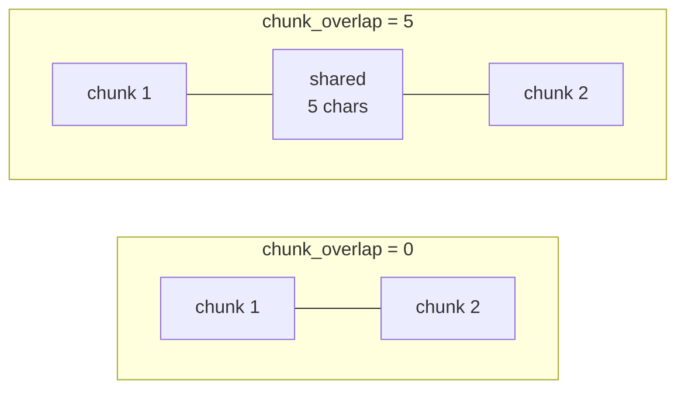

# Chunk Overlap

> Status: `studied` | Section: [Chunking](../README.md)

## What is it?

`chunk_overlap` — how much text is repeated between two consecutive chunks.
The next chunk starts a little **before** the previous one ended, so a band of
text belongs to both.



## Why does it exist?

To repair the damage done by cutting. A split — especially a length-based one —
lands in the middle of a sentence or an idea, leaving half the context in one
chunk and half in the next. Neither chunk is then self-sufficient, and neither
embedding represents the idea properly.

Overlap starts the next chunk slightly earlier, so the information that was cut
appears in full in at least one of the two chunks. The context is carried
across the boundary instead of being lost at it.

## Problem it solves

Loss of context at chunk boundaries.

## How it works

With `chunk_size=100` and `chunk_overlap=5`, chunk 2 begins at character 95
rather than 100, so five characters appear in both chunks. Increase the overlap
and the shared band grows.

## Architecture

A constructor argument on every splitter:

```python
RecursiveCharacterTextSplitter(chunk_size=100, chunk_overlap=15)
```

LangChain's default is `chunk_overlap=200` against a default `chunk_size=4000`
— i.e. 5%.

## Important concepts

- **Shared band** — the region belonging to two chunks.
- **Duplication cost** — overlapping text is stored, embedded and possibly
  retrieved more than once.
- **10–20% rule of thumb** — for RAG, an overlap of roughly 10–20% of
  `chunk_size` is a reasonable starting point. At `chunk_size=100` that is
  10–20 characters; the overlap scales with the chunk size.

## Mathematical intuition

With length-based splitting, the step between chunk starts is:

```
step = chunk_size - chunk_overlap
```

so:

```
number_of_chunks ≈ ceil(len(text) / (chunk_size - chunk_overlap))
```

Two consequences fall straight out of that denominator:

- Overlap increases chunk count **non-linearly**. At `chunk_size=100`, an
  overlap of 50 does not add 50% more chunks — it doubles them.
- As `chunk_overlap` approaches `chunk_size`, `step` approaches zero and the
  chunk count explodes. Overlap must always be meaningfully smaller than the
  chunk size.

## Implementation details

- Overlap applies at the merge step, so with
  [recursive splitting](../02-recursive-chunking/) that already breaks on clean
  paragraph or sentence boundaries, there is less for overlap to rescue. It
  matters most where cuts are arbitrary.
- Duplicated text means the same sentence can be retrieved twice inside
  different chunks, spending context budget on a repeat.

## What I initially misunderstood

<!-- To fill in from my notebook. -->

TODO

## What I learned

- Overlap is a patch for a bad cut, not a feature in its own right. The better
  the splitting strategy, the less overlap is needed.
- It is a genuine trade-off, not a free improvement: more overlap means more
  chunks, more embeddings, more storage and more compute.
- The cost is non-linear, which makes "just set it high to be safe" a bad
  instinct.

## Limitations

- It cannot recover meaning that was split across a boundary *wider* than the
  overlap.
- It inflates the index with duplicated content.
- It does nothing about the real problem when chunks are badly chosen — it just
  makes the seams less sharp.

## When should I use it?

- With length-based splitting, where cuts are arbitrary by construction.
- Where continuity across boundaries matters — narrative text, transcripts,
  step-by-step procedures.

Start at 10–20% of `chunk_size`.

## When should I NOT use it?

- When chunks are already independently meaningful (rows, records, well-formed
  sections) — overlap only adds duplication.
- When index size or embedding cost is the binding constraint.

## Related concepts

- [03-chunk-size](../03-chunk-size/) — overlap is expressed relative to it
- [01-fixed-size-chunking](../01-fixed-size-chunking/) — where overlap matters most
- [02-recursive-chunking](../02-recursive-chunking/) — where it matters less

## Questions I still have

- Does overlap measurably improve retrieval, or does it mostly inflate the
  index? This is testable once an evaluation set exists.
- If two overlapping chunks both get retrieved, is the duplicated text a real
  problem in the prompt?

<!-- Add my own questions here. -->
