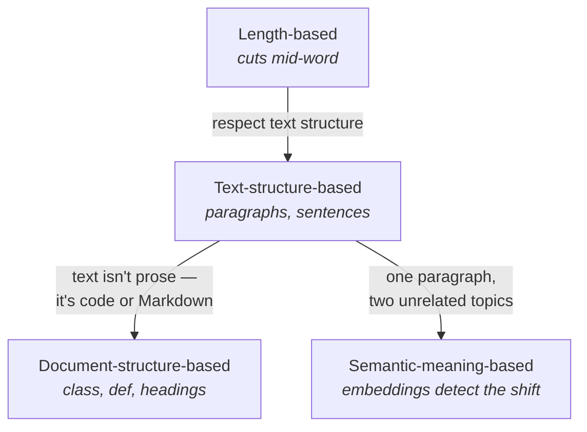
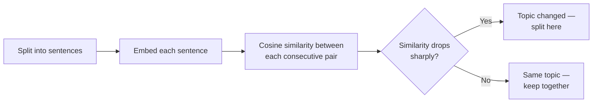

# Chunking Strategies

> Status: `studied` | Section: [Chunking](../README.md)

## What is it?

The four ways of deciding *where* to cut, ordered by how much they understand
about the text:

| # | Strategy | Decides cuts using | Class |
| --- | --- | --- | --- |
| 1 | Length-based | A character or token count | `CharacterTextSplitter` |
| 2 | Text-structure-based | Paragraphs → lines → words → chars | `RecursiveCharacterTextSplitter` |
| 3 | Document-structure-based | Format constructs (`class`, `def`, `#`) | `RecursiveCharacterTextSplitter.from_language(...)` |
| 4 | Semantic-meaning-based | Where the meaning changes | `SemanticChunker` (experimental) |

Strategies 1 and 2 have their own topics
([01](../01-fixed-size-chunking/), [02](../02-recursive-chunking/)). This topic
covers 3 and 4, and how to choose between all four.

## Why does it exist?

Each strategy exists because the previous one fails on some class of document.



## Problem it solves

Matching the splitting rule to the kind of document you actually have.

## How it works

### Strategy 3 — Document-structure-based

Some documents are text but not *prose*. A Python file is not organised into
paragraphs and sentences; it is organised into classes, functions and blocks.
Markdown is organised into headings, lists and code fences. Splitting either as
if it were an essay produces chunks that cut a function in half.

The insight: this needs **no new algorithm**. It is the same recursive splitter
with a different separator list.

```python
from langchain_text_splitters import Language, RecursiveCharacterTextSplitter

splitter = RecursiveCharacterTextSplitter.from_language(
    language=Language.PYTHON,
    chunk_size=300,
    chunk_overlap=0,
)
```

Verified separator lists (`langchain_text_splitters` 1.1.2):

| Language | Separators, in priority order |
| --- | --- |
| `PYTHON` | `'\nclass '`, `'\ndef '`, `'\n\tdef '`, `'\n\n'`, `'\n'`, `' '`, `''` |
| `MARKDOWN` | `'\n#{1,6} '` (heading regex), the code-fence marker, `'\n\*\*\*+\n'`, `'\n---+\n'`, `'\n___+\n'`, `'\n\n'`, `'\n'`, `' '`, `''` |

Both lists end with the ordinary paragraph → line → word → character fallbacks,
so the format-specific separators are tried *first* and normal text splitting
takes over below them.

> **Technical note — the language separators are narrower than they look.**
> `'\nclass '` and `'\ndef '` require the keyword at the **start of a line**.
> They match top-level definitions, and `'\n\tdef '` matches tab-indented ones —
> but nothing in the list matches a **space-indented** method inside a class,
> which is what ordinary PEP 8 code looks like.
>
> Measured: on a class with 4-space-indented methods, `from_language(PYTHON)`
> produced output **identical** to the generic splitter at every chunk size
> tried, because none of the Python separators ever fired. The difference only
> appears when the definitions are at top level:
>
> | `chunk_size=100`, three top-level functions, no blank lines | Result |
> | --- | --- |
> | Generic recursive | A chunk ends on `def chunk(text, size):` — signature severed from its body |
> | `from_language(PYTHON)` | One whole function per chunk |
>
> Worth knowing before assuming `from_language` is doing something for you.

`Language` has 28 members, including `PYTHON`, `JS`, `TS`, `JAVA`, `PHP`, `GO`,
`RUST`, `HTML`, `MARKDOWN`, `LATEX`.

Observed behaviour on a Python file: at `chunk_size≈175` the class body,
each method and the usage block became separate chunks; at 350 the whole class
became one chunk and the usage code another.

> **Technical note.** `langchain_text_splitters` also ships header-aware
> splitters — `MarkdownHeaderTextSplitter` and `HTMLHeaderTextSplitter` — which
> split on headings and attach them as metadata instead of just using them as
> separators. Different tool, same motivation.

### Strategy 4 — Semantic-meaning-based

The case neither length nor structure can handle:

```text
Paragraph 1:  ...farming and agriculture...  ...the Indian Premier League...
Paragraph 2:  ...terrorism...
```

Structurally this is two paragraphs, so a recursive splitter produces two
chunks. But paragraph 1 covers **two completely unrelated topics**, and its
embedding will be an average of agriculture and cricket. It should have been
three chunks.

Semantic chunking decides cuts from meaning instead of from characters:



It walks a sliding window through consecutive sentence pairs — s1↔s2, s2↔s3,
s3↔s4 — and where similarity falls off a cliff, the topic has changed and a
breakpoint is placed.

```python
from langchain_experimental.text_splitter import SemanticChunker
from langchain_openai import OpenAIEmbeddings

splitter = SemanticChunker(
    OpenAIEmbeddings(),
    breakpoint_threshold_type="standard_deviation",
    breakpoint_threshold_amount=1,
)
```

"Falls off a cliff" needs a definition, which is what
`breakpoint_threshold_type` supplies:

| Type | Rule |
| --- | --- |
| `percentile` (default) | Split where the distance exceeds the Nth percentile of all distances |
| `standard_deviation` | Split where the distance exceeds N standard deviations |
| `interquartile` | Split using the interquartile range |
| `gradient` | Split based on the rate of change of distance |

`breakpoint_threshold_amount` is the N. Raising it makes the splitter more
tolerant of change and produces fewer chunks — at 3 standard deviations the
whole example collapsed to a single chunk, because nothing looked different
enough.

**Measured result on the agriculture/IPL/terrorism example:** three chunks, as
hoped — but one sentence ("The sun was bright and the air smelled of earth and
fresh grass") landed in the IPL chunk when it belonged with agriculture. The
idea works; the precision is not there yet.

## Architecture

| Strategy | Package | Status |
| --- | --- | --- |
| 1, 2, 3 | `langchain_text_splitters` | Stable |
| 4 | `langchain_experimental` | **Experimental** — not part of the main library |

Strategy 4 also needs an embedding model, which means an API call (or a local
model) for every sentence — the only strategy here with a runtime cost beyond
string processing.

## Important concepts

- **Same algorithm, different separators** — strategy 3 is not a new splitter.
- **`Language` enum** — selects the separator list.
- **Breakpoint threshold** — how big a similarity drop counts as a topic change.
- **Experimental** — `SemanticChunker` is a preview, not a default.

## Mathematical intuition

Semantic chunking reduces to detecting change points in a similarity series.
For consecutive sentence embeddings:

```
dᵢ = 1 − cos( E(sᵢ), E(sᵢ₊₁) )
```

Place a breakpoint wherever `dᵢ` is an outlier in `{d₁ … dₙ₋₁}` — with
"outlier" defined by the chosen threshold type (percentile, standard deviation,
IQR, gradient). The whole method is outlier detection over a distance series.

## Implementation details

- `from_language` returns an ordinary `RecursiveCharacterTextSplitter`, so
  `chunk_size`, `chunk_overlap` and the three split methods behave identically.
- `SemanticChunker` is deliberately **not** implemented in this topic's
  `implementation.py`: it depends on embeddings, which belong to
  [04-embeddings](../../04-embeddings/) and have not been studied yet.

## What I initially misunderstood

<!-- To fill in from my notebook. -->

TODO

## What I learned

- Three of the four strategies are the same recursive algorithm with different
  separator lists. That collapses most of the apparent complexity.
- The strategies form a ladder of how much the splitter understands, and each
  rung exists because of a concrete failure of the one below.
- Semantic chunking is the most intellectually appealing and the least reliable
  right now. Promising is not the same as usable.
- `RecursiveCharacterTextSplitter` is the practical answer for almost
  everything, and the one to reach for by default.

## Limitations

- **Document-structure-based** needs to know the language in advance, and only
  supports the 28 in the enum.
- **Semantic-meaning-based** is experimental, costs an embedding call per
  sentence, is sensitive to the threshold setting, and in practice still
  misplaces sentences.

## When should I use it?

| Situation | Strategy |
| --- | --- |
| Quick baseline, unstructured text | Length-based |
| **Prose, docs, transcripts — the default** | **Text-structure-based** |
| Source code, Markdown, HTML | Document-structure-based |
| Paragraphs reliably mix unrelated topics, and quality justifies the cost | Semantic (experimental) |

## When should I NOT use it?

Do not reach for semantic chunking first. It is slower, costs money per
sentence, and on the examples tested it was not clearly better than recursive
splitting.

## Related concepts

- [01-fixed-size-chunking](../01-fixed-size-chunking/) — strategy 1
- [02-recursive-chunking](../02-recursive-chunking/) — strategy 2
- [03-chunk-size](../03-chunk-size/) · [04-chunk-overlap](../04-chunk-overlap/) — parameters shared by all
- [04-embeddings](../../04-embeddings/) — what strategy 4 depends on

## Questions I still have

- Would semantic chunking do better with a stronger embedding model, or is the
  sentence-pair approach itself the limitation?
- For a mixed corpus (PDFs + code + Markdown), is routing each file type to its
  own splitter the standard approach?

<!-- Add my own questions here. -->
