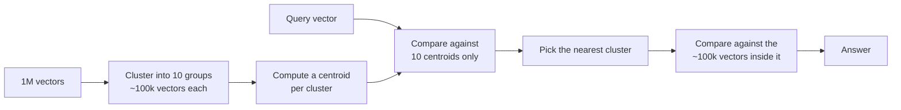

# Vector Indexing

> Status: `studied` | Section: [Vector Search](../README.md)

## What is it?

A data structure that makes similarity search fast, by avoiding a comparison
against every stored vector.

## Why is it used?

Brute-force search is `O(n)`. With 1,000,000 stored vectors, answering one query
means 1,000,000 similarity computations plus a sort. That is far too slow for a
live application.

## How it works

The simplest technique is **clustering**:

Cost drops from **1,000,000** comparisons to **100,010** - a 10x reduction, for
roughly the same answer.

Production systems use more sophisticated variants, the best known being
**Approximate Nearest Neighbour (ANN)** search.

## Important points

- Indexing trades **exactness for speed**. The nearest vector might sit in a
  cluster you skipped, so the result is *approximate*.
- That trade is almost always worth it - the accuracy loss is small, the speed
  gain is large.
- This is the same idea as an index in a relational database: precompute
  structure so reads get cheaper.

## Related

- [01-vector-databases](../01-vector-databases/) - indexing is one of its four features
- [07-advanced-retrieval/06-ann](../../07-advanced-retrieval/06-ann/) · [07-hnsw](../../07-advanced-retrieval/07-hnsw/) - the deeper treatment, not yet studied
