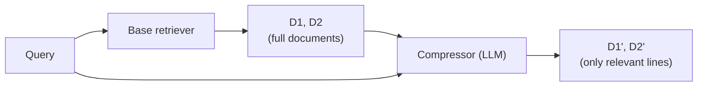

# Contextual Compression

> Status: `studied` | Section: [Retrieval](../README.md)

## What is it?

A retriever that **trims retrieved documents after retrieval**, keeping only the
parts relevant to the query.

## Why is it used?

A retrieved chunk is often only partly relevant. Example - one stored document:

```
The Grand Canyon is a famous natural site.
Photosynthesis is how plants convert light into energy.
Many tourists visit every year.
```

Query: *"What is photosynthesis?"* The retriever correctly returns this document
- but two of its three sentences are noise.

**Why would a document look like that?** Because chunking is not perfect. A text
splitter has no full control over where it cuts, so a chunk can end up spanning
the end of one topic and the start of another.

## How it works

Two components:

1. A **base retriever** (e.g. plain similarity search) fetches N documents.
2. A **compressor** - usually an LLM - receives each document plus the query and
   strips out everything irrelevant.



## Simple example

```python
from langchain.retrievers import ContextualCompressionRetriever
from langchain.retrievers.document_compressors import LLMChainExtractor

compressor = LLMChainExtractor.from_llm(llm)

retriever = ContextualCompressionRetriever(
    base_compressor=compressor,
    base_retriever=vector_store.as_retriever(search_kwargs={"k": 3}),
)

retriever.invoke("What is photosynthesis?")
```

Result: paragraph-length documents come back as single relevant sentences. The
Grand Canyon and basketball content is gone.

## Important points

- **It costs an LLM call per retrieved document.** Not free, in latency or money.
- Use it when documents are long and mix topics, when you need to reduce context
  length, or when answer accuracy needs improving.
- It compresses *after* retrieval - it cannot recover a document that retrieval
  missed.

## Related

- [01-semantic-retrieval](../01-semantic-retrieval/)
- [03-chunking](../../03-chunking/) - better chunking reduces the need for this
- [09-context-engineering/02-context-compression](../../09-context-engineering/02-context-compression/)
