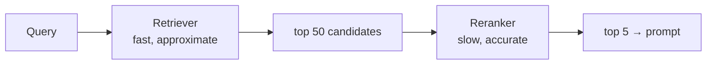

# Reranking Basics

> Status: `studied` (self-study, outside the course) | Section: [Retrieval](../README.md)

## What is it?

A **second scoring pass** over the documents that first-stage retrieval
returned, using a slower but more accurate model to reorder them.

## Why it matters

First-stage retrieval optimises for speed over a huge corpus, so its ranking is
rough. Reranking fixes the ordering of the few candidates that actually reach
the prompt — and since the LLM only sees the top few, ordering is what decides
the answer.

## How it works

The **retrieve-many / rerank-few** pattern:



Retrieve wide (k=50), rerank down to what fits (k=5). The reranker sees query
and document *together*, so it can judge relevance far better than comparing two
independently-computed vectors.

## Simple example

```
query: "how do I cancel my subscription?"

after retrieval (by vector similarity)   after reranking
1. subscription pricing tiers            1. cancelling your subscription
2. cancelling your subscription          2. refund policy after cancellation
3. how to subscribe                      3. subscription pricing tiers
```

## Remember

- Reranking **cannot recover a document retrieval missed**. It only reorders
  what it was given, so first-stage recall still sets the ceiling.
- It costs latency — a model call per candidate. Rerank 20–50, not 1000.
- Biggest wins come when the corpus has many near-duplicates or the query is
  phrased unlike the documents.
- Common implementations: cross-encoder models, or hosted rerank APIs.

## Related

- [07-advanced-retrieval/10-cross-encoder-reranking](../../07-advanced-retrieval/10-cross-encoder-reranking/) — how it works internally
- [01-semantic-retrieval](../01-semantic-retrieval/) · [02-mmr](../02-mmr/)
