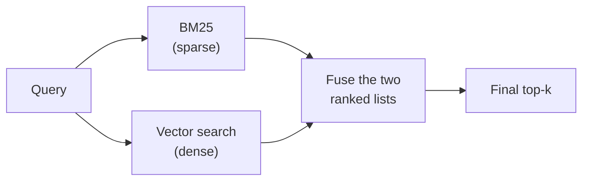

# Hybrid Search

> Status: `studied` (self-study, outside the course) | Section: [Advanced Retrieval](../README.md)

## What is it?

Running sparse (BM25) and dense (vector) retrieval on the same query and
combining their result lists.

## Why it matters

The two methods fail on different queries. Combining them covers both, and
usually beats either alone — one of the highest value-per-effort upgrades to a
basic RAG pipeline.

## How it works



Two ways to fuse:

1. **Score-based** — normalise both score sets and take a weighted sum.
   Fragile: the score scales are completely different and unstable.
2. **Rank-based** — ignore scores, use positions only. This is
   [RRF](../05-reciprocal-rank-fusion/), and it is the usual choice.

## Simple example

```
query: "reset 2FA on my account"

BM25 top 3      : [doc_2FA_setup, doc_password_reset, doc_login_errors]
Dense top 3     : [doc_account_recovery, doc_2FA_setup, doc_security_faq]
Fused (RRF)     : [doc_2FA_setup, doc_account_recovery, doc_password_reset, ...]
```

`doc_2FA_setup` ranks first because it appears high in *both* lists.

## Remember

- Fusing by **rank is more robust than fusing by score** — BM25 and cosine
  scores are not comparable quantities.
- You now maintain two indexes and pay two lookups per query.
- A weighting knob (how much to trust each side) is corpus-specific — measure it.
- Documents appearing in both lists get a strong, well-earned boost.

## Related

- [02-bm25](../02-bm25/) · [03-sparse-vs-dense](../03-sparse-vs-dense/) · [05-reciprocal-rank-fusion](../05-reciprocal-rank-fusion/)
