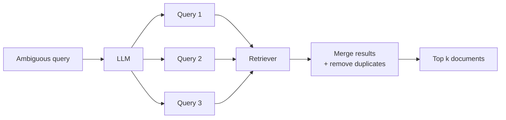

# Multi-Query Retrieval

> Status: `studied` | Section: [Query Transformation](../README.md)

## What is it?

A retriever that uses an LLM to turn one user query into **several rephrased
queries**, retrieves for each, and merges the results.

## Why is it used?

User queries are often ambiguous. *"How can I stay healthy?"* could mean:

- What should I eat?
- How often should I exercise?
- How do I manage stress?

Each reading needs different documents. A single embedding of a vague question
retrieves vaguely - and can latch onto the wrong thing entirely. In the lesson's
test, the query *"How to improve energy levels and maintain balance"* made a
plain retriever return a document about **solar systems in modern homes**,
because it matched on "energy" and "balance".

## How it works



1. Send the query to an LLM, which generates several related versions.
2. Run the base retriever on each one.
3. Merge all results and drop duplicates.
4. Return the top k.

## Simple example

```python
from langchain.retrievers.multi_query import MultiQueryRetriever

retriever = MultiQueryRetriever.from_llm(
    retriever=vector_store.as_retriever(search_kwargs={"k": 5}),
    llm=ChatOpenAI(),
)

retriever.invoke("How to improve energy levels and maintain balance")
```

On the same query that confused the plain retriever, all five results came back
about health and nutrition - the solar-system document was gone.

## Important points

- Costs one extra LLM call per query, before retrieval even starts.
- The base retriever can be anything - plain similarity or MMR.
- It fixes **ambiguity in the query**, not gaps in the corpus.

## Related

- [06-retrieval/01-semantic-retrieval](../../06-retrieval/01-semantic-retrieval/)
- [01-query-rewriting](../01-query-rewriting/) · [05-rag-fusion](../05-rag-fusion/) - not yet studied
