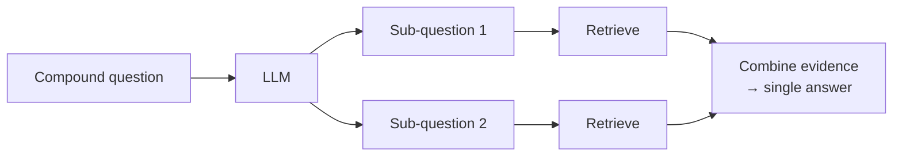

# Query Decomposition

> Status: `studied` (self-study, outside the course) | Section: [Query Transformation](../README.md)

## What is it?

Breaking a compound question into independent sub-questions, retrieving for each
separately, then combining the evidence into one answer.

## Why it matters

Some questions cannot be answered by any single chunk, because the facts live in
different documents. A single retrieval pass returns a blend that answers
neither part well.

## How it works



## Simple example

```
"How does our refund policy compare to our competitor's, and which is faster?"

  → "What is our refund policy?"
  → "What is the competitor's refund policy?"
  → "What is the processing time for each?"
```

Each sub-question retrieves cleanly; the originals retrieve a muddle.

## Remember

- Best for **comparison and multi-part** questions ("compare X and Y", "and
  also...").
- Costs one LLM call plus one retrieval **per sub-question** — the expensive
  option in this section.
- Sub-questions must be genuinely independent; if the second depends on the
  first's answer, that is iterative retrieval, not decomposition.
- Deduplicate before assembling context — sub-questions often retrieve overlaps.

## Related

- [08-sub-question-retrieval](../08-sub-question-retrieval/) · [03-multi-query-retrieval](../03-multi-query-retrieval/)
