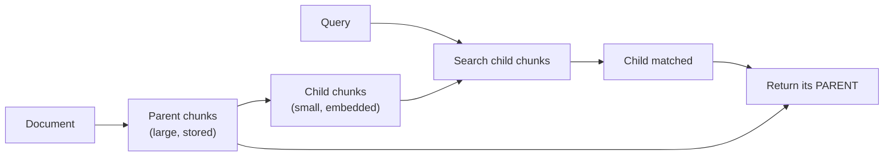

# Parent Document Retrieval

> Status: `studied` (self-study, outside the course) | Section: [Context Engineering](../README.md)

## What is it?

**Search small, return big.** Index small chunks for precise matching, but when
one matches, hand the LLM the larger parent block it came from.

## Why it matters

It resolves the core chunk-size conflict: small chunks retrieve accurately but
lack context; large chunks carry context but retrieve poorly. This gets both.

## How it works



Only the children are embedded. The parents live in a document store, looked up
by id.

## Simple example

```
child  (200 chars, indexed) : "...the timeout must be set to 30s..."
parent (2000 chars, returned): the full configuration section, including what
                               the setting does and what breaks if it is wrong
```

## Remember

- Two stores: a vector store for children, a doc store for parents.
- **Deduplicate parents** — several matching children often share one parent.
- Parents must be small enough that a few still fit the context window.
- LangChain implements this as `ParentDocumentRetriever`.

## Related

- [08-small-to-big-retrieval](../08-small-to-big-retrieval/) — the same idea, generalised
- [03-chunking/03-chunk-size](../../03-chunking/03-chunk-size/)
