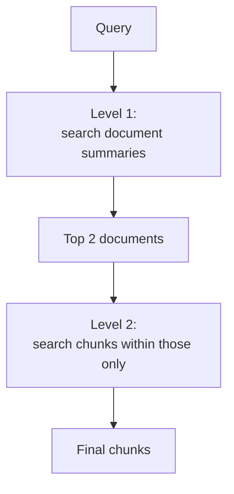

# Hierarchical Retrieval

> Status: `studied` (self-study, outside the course) | Section: [Context Engineering](../README.md)

## What is it?

Retrieving in **layers**: first find the right document or section using
summaries, then search for detailed chunks only inside it.

## Why it matters

On large or multi-tenant corpora, flat search over every chunk is both slow and
noisy — chunks from irrelevant documents compete with the right ones on
superficial wording. Narrowing first removes them entirely.

## How it works



Build time: summarise each document (and optionally each section), and index the
summaries as their own layer.

## Simple example

```
query: "what is the vacation carry-over limit?"

level 1 → "HR Policy 2024" summary matches   (skips Engineering Handbook,
                                              Security Policy, ...)
level 2 → search only HR Policy chunks → the carry-over clause
```

## Remember

- Cuts the search space **and** the noise — the main win is precision, not speed.
- **A level-1 miss is unrecoverable**: pick the wrong document and the right
  chunk can never be found. Keep level 1 generous (top 3–5, not top 1).
- Summaries must be regenerated when documents change.
- Closely related to routing — choosing an index per query.

## Related

- [08-small-to-big-retrieval](../08-small-to-big-retrieval/) · [10-advanced-rag/06-retrieval-routing](../../10-advanced-rag/06-retrieval-routing/)
